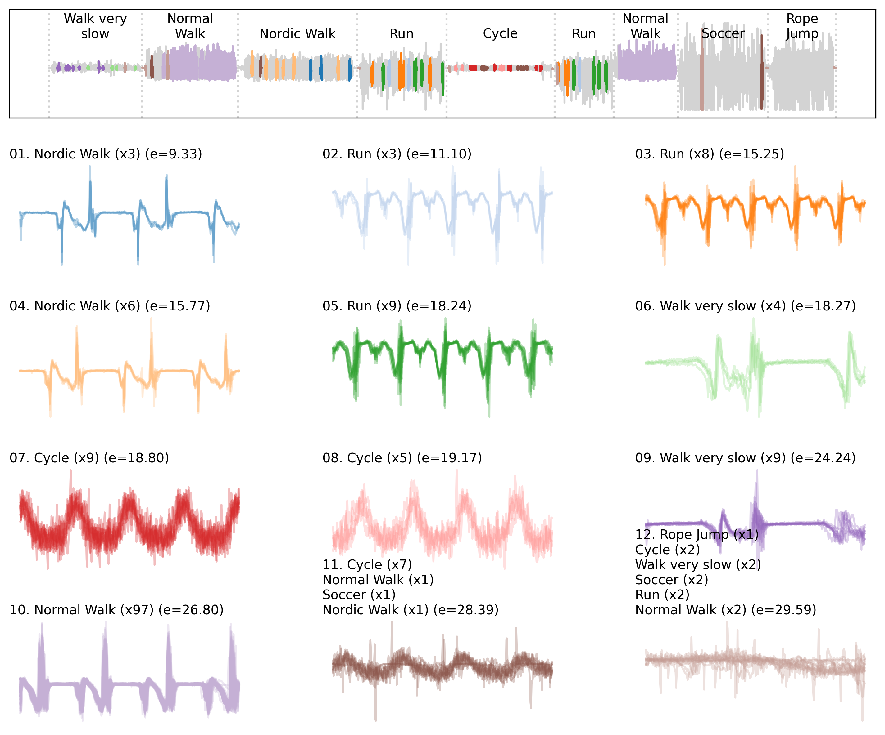
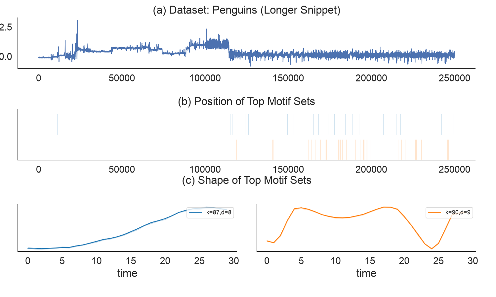

# SCAMPI - Fast motif discovery for massive time series

Time series often contain patterns that repeat: heartbeats, walking cycles, machine 
operations, gestures, or other recurring behavior.

**SCAMPI (Scalable Anytime Mining of Patterns in Time Series)** finds recurring patterns 
in large time series without exhaustively comparing every pair of subsequences. SCAMPI 
searches for these patterns approximately and under a configurable memory budget.

Key features of SCAMPI:
- **Scales to massive datasets** under a fixed memory budget
- **Finds top-N motif sets** with many recurring occurrences
- **Anytime algorithm:** results improve as more computation is allowed

---

### Use Case: Mining Human Activities

The example below uses approximately **174,000 acceleration measurements at 100 Hz** from a shoe-mounted sensor during 29 minutes of outdoor activity.
SCAMPI consumes only the signal and requires **no activity labels or prior segmentation**.
Using a motif length of 400 points (4 seconds), it discovers recurring patterns corresponding to activities including Nordic walking, running, slow walking, cycling, and normal walking.
One discovered motif (No. 10) contains **97 occurrences across two normal-walking segments**.



Note: the activity labels were added only afterwards to interpret the discovered patterns.
See the [human-activity notebook](notebooks/human_activity_usecase.ipynb) for the complete analysis.

---

## Installation

Install SCAMPI from PyPI:

```bash
python -m pip install scampi
```

To use the bundled datasets, notebooks, and experiments, install from source:

```bash
git clone https://github.com/patrickzib/scampi.git
cd scampi
python -m pip install .
```

---

## Quick start

The following example searches the first 250,000 points of the bundled penguin X-acceleration recording:

```python
from importlib.resources import files
import pandas as pd
from scampi.scampi import SCAMPI

with files("scampi").joinpath("data", "penguin.txt.gz").open("rb") as data:
    series = pd.read_csv(
        data,
        compression="gzip",
        sep="\t",
        header=None,
        usecols=[0],
        nrows=250_000,
        dtype="float64",
    ).iloc[:, 0]


model = SCAMPI(
    ds_name="Penguin — X-acceleration",
    series=series,
    n_jobs=1,
    backend="scampi",
    scampi_max_memory="1 GB",
    scampi_delta=0.1,
)

dists, candidates, elbow_points = model.fit_k_elbow(
    k_max=100,
    motif_length=30,
    top_N=2,
    plot_elbows=False,
    plot_motifs_as_grid=True,
)

```

- `motif_length=30` searches for patterns 30 time points long;
- `k_max=100` allows up to 100 occurrences per motif set;
- `top_N=2` searches for the top two motif sets, each with up to `k_max` occurences;
- `scampi_max_memory="1 GB"` limits the memory used by SCAMPI's internal data structures.
- `plot_motifs_as_grid=True` creates the following image of found motif sets.



---

## Key parameters

| Parameter | Description |
| --- | --- |
| `series` | Input time series as a NumPy array or pandas Series |
| `motif_length` | Length of each motif occurrence in time points |
| `k_max` | Maximum number of occurrences in a motif set |
| `top_N` | Number of motif-set candidates to search for |
| `slack` | Controls how much discovered occurrences may overlap |
| `scampi_max_memory` | Memory budget for SCAMPI's similarity graph |
| `scampi_delta` | Approximation parameter; default: `0.1` |

---

## Benchmarks

Benchmark runners and reproduction utilities are available under [`benchmarks/`](benchmarks/).

```bash
python benchmarks/cli/run_momp_benchmarks.py \
    --methods scampi \
    --datasets EOG_one_hour_50_Hz \
    --lengths 512 \
    --local-n 10000 \
    --k-max 10 \
    --scampi-max-memory "1 GB" \
    --no-exact-refine
```

Use `--help` on the benchmark commands to see available datasets, parameters, and output options.

---

## Repository

```text
scampi/        SCAMPI implementation and search backends
benchmarks/    benchmark runners and evaluation utilities
notebooks/     examples, case studies, and paper analyses
datasets/      bundled and local benchmark datasets
tests/         correctness and scalability tests
images/        README and case-study figures
```
